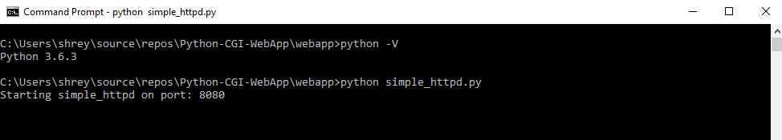
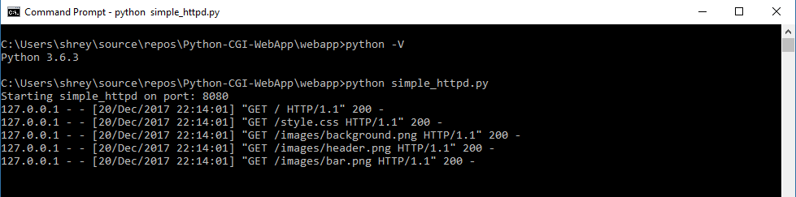
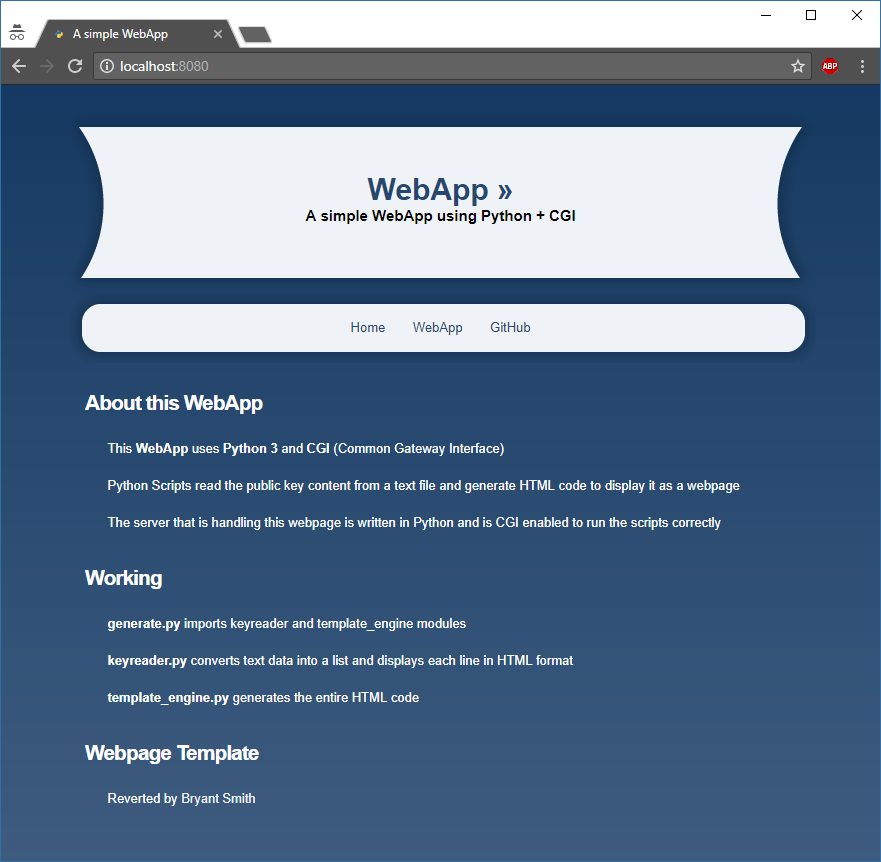
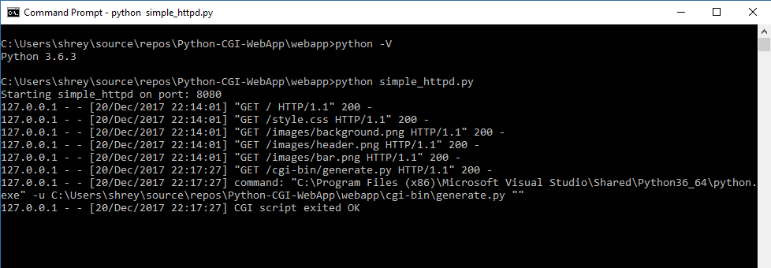
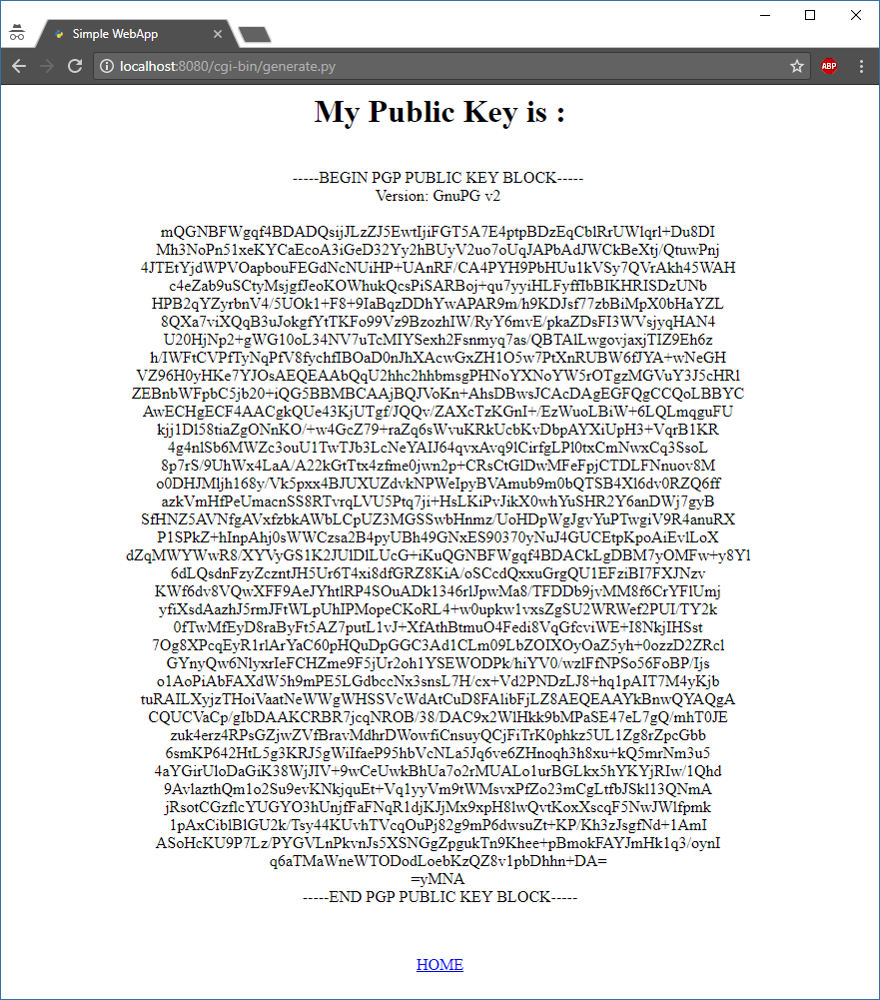

# Python-CGI-WebApp

## About

> **Python-CGI-WebApp** is a simple web application that uses **Python 3** scripts to generate dynamic webpages.

> A **CGI** _(Common Gateway Interface)_ enabled **HTTP server** (written in Python 3) handles these requests.

## CGI (Common Gateway Interface)

The _Common Gateway Interface_ offers a standard protocol for web servers to execute programs that execute like Console applications running on a server that generates web pages dynamically.


## Working

There are three Python Scripts that work together to generate the HTML webpage

* **generate.py**
	
	The Home Page has a link to this python script to start the Web Application.
	The script imports "keyreader.py" and "template_engine.py" modules and makes function calls to generate the webpage.

* **keyreader.py**

	This Python script has a function called "getkey(loc)" that takes the location of a text file as argument.
	The text file contains a PUBLIC KEY. The function reads the entire content and splits them at '\n' to create a list.
	Each item in the list is then converted to an HTML line and printed.

* **template_engine.py**

	This script is completely responsible for generating the entire webpage.
	It has several function that generate the required HTML code.
	To make sure that printed strings are interpreted as HTML code by the browser a function specifies the CGI Content.

```
Content type: text/html \n\n
```

## Prerequisites and Deployment

This WebApp requires Python3. Get Python3 from here

> https://www.python.org/

### 0. Downloading the Project

Clone the project from here

> https://github.com/shashank9830/Python-CGI-WebApp

### 1. Running the WebApp

1. After cloning the project open terminal and change directory to webapp/

```sh
$ cd webapp
```

Start the HTTP Server with following command

```sh
$ python simple_httpd.py
```

You should see the following output on terminal



This means the server is ready to take requests

_DON'T CLOSE THIS TERMINAL_

2. Open your web browser and type localhost:8080

You should see the following output on terminal



3. On the browser you should see this webpage



4. Click on the **WebApp** link and you should see successfull execution message in terminal



5. A new dynamic webpage will be generated like this



### 2. Shutting down the web server

> To stop the web server simply close the terminal or press [Ctrl + C] in the terminal

## Authors

* **Shashank Singh** - [shashank9830](https://github.com/shashank9830)

## License

This project is licensed under the MIT License - see the [LICENSE.md](LICENSE.md) file for details